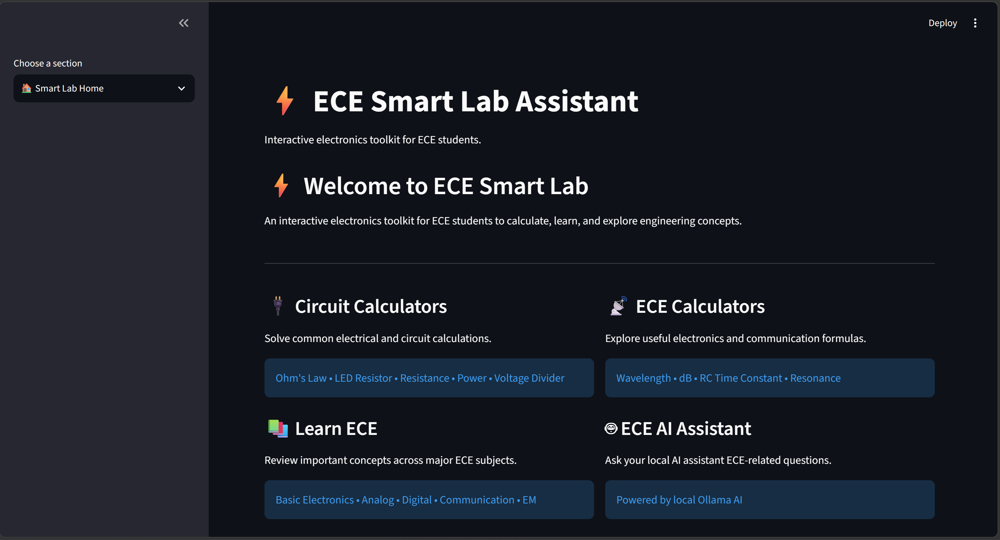
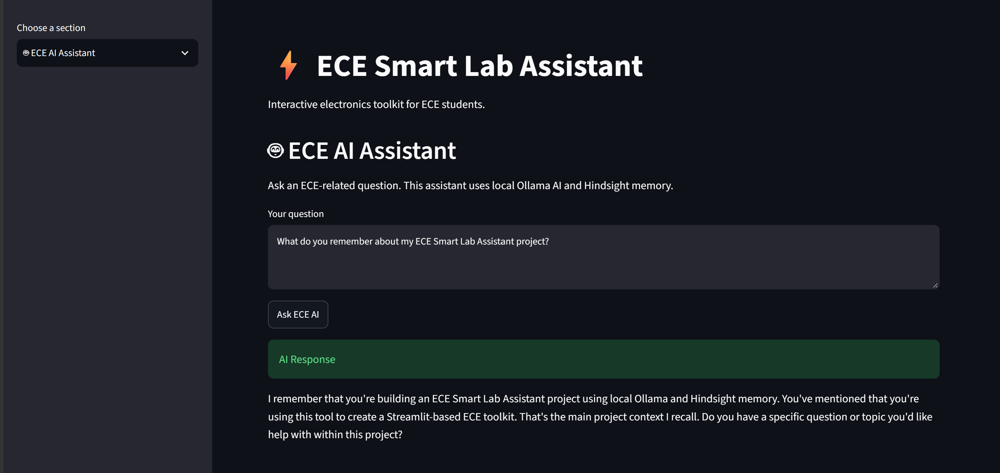
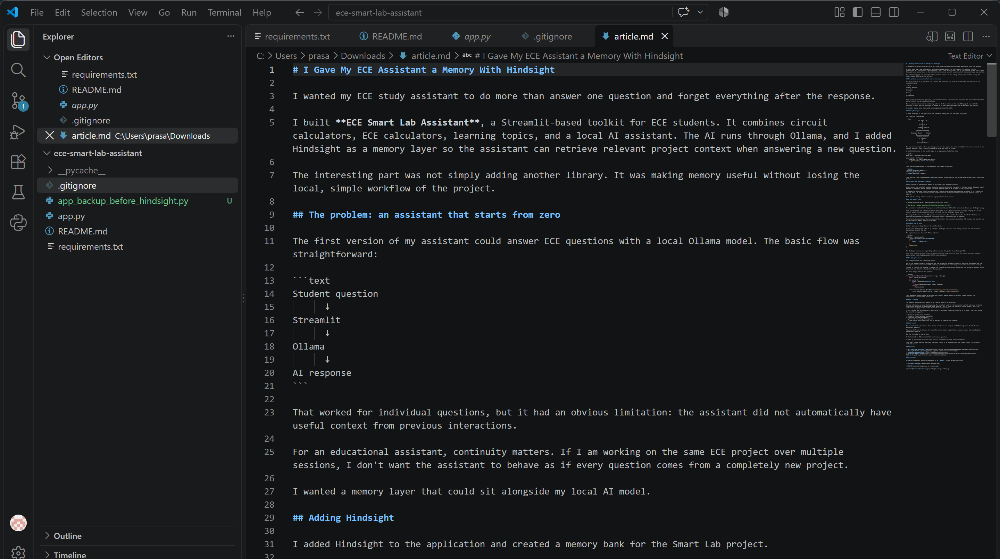

# I Gave My ECE Assistant a Memory With Hindsight

I wanted my ECE study assistant to do more than answer one question and forget everything after the response.

I built **ECE Smart Lab Assistant**, a Streamlit-based toolkit for ECE students. It combines circuit calculators, ECE calculators, learning topics, and a local AI assistant. The AI runs through Ollama, and I added Hindsight as a memory layer so the assistant can retrieve relevant project context when answering a new question.

The interesting part was not simply adding another library. It was making memory useful without losing the local, simple workflow of the project.

## The problem: an assistant that starts from zero

The first version of my assistant could answer ECE questions with a local Ollama model. The basic flow was straightforward:

```text
Student question
      ↓
Streamlit
      ↓
Ollama
      ↓
AI response
```

That worked for individual questions, but it had an obvious limitation: the assistant did not automatically have useful context from previous interactions.

For an educational assistant, continuity matters. If I am working on the same ECE project over multiple sessions, I don't want the assistant to behave as if every question comes from a completely new project.

I wanted a memory layer that could sit alongside my local AI model.

## Adding Hindsight

I added Hindsight to the application and created a memory bank for the Smart Lab project.

The resulting flow became:

```text
                 ECE Smart Lab
                       │
                       ▼
                  Streamlit UI
                       │
                 Student question
                       │
              ┌────────┴────────┐
              ▼                 ▼
       Hindsight Recall      Ollama
              │                 │
              └────────┬────────┘
                       ▼
                  AI response
                       │
                       ▼
                Hindsight Retain
```

The key idea is simple: before generating an answer, the application asks Hindsight for memories relevant to the current question. Those results are added to the prompt sent to Ollama.

A simplified version of the recall logic in my application looks like this:

```python
memories = _hindsight_recall(prompt)

memory_text = "\n".join(
    item.text for item in memories.results
    if getattr(item, "text", "").strip()
)
```

Then the retrieved context is included with the student's question:

```python
"Relevant Hindsight memory:\n"
f"{memory_text}\n\n"
f"Student question: {prompt}"
```

This gave the local language model additional context without putting the entire conversation history into every prompt.

## The part that mattered: relevance

During testing, I learned that memory is not useful just because it exists.

At one point, the assistant produced unrelated project information from memory. That was a good debugging moment because it exposed a design problem: retrieved memories need to be relevant to the current task.

I changed the assistant's instructions so that recalled information should be used only when it is relevant to the ECE Smart Lab project or the current student question, while unrelated or conflicting memories should be ignored.

That made the memory behavior much more appropriate for this project.

## A real memory test

I tested the system with a question about the project itself:

> What do you remember about my ECE Smart Lab Assistant project?

The assistant recalled that the project is a Streamlit-based ECE toolkit using local Ollama and Hindsight memory.

That was the moment the integration became meaningful to me. The assistant was no longer relying only on the current prompt; it was using information retrieved from the Hindsight memory layer.

The project also has a normal ECE question-answering mode. For example, I tested a Kirchhoff's Voltage Law question and received an explanation containing the KVL relationship and an example.

These two tests demonstrate the two sides of the system: the assistant can explain ECE concepts and can also use project-specific memory when it is relevant.

## Keeping the AI local

Another goal was to keep the core AI workflow local.

Ollama runs the language model on my computer. Hindsight runs as a local memory service, and the Streamlit application connects the two.

The application uses the local Ollama endpoint:

```python
response = requests.post(
    "http://localhost:11434/api/generate",
    json={
        "model": "llama3.2:3b",
        ...
    },
    timeout=120,
)
```

The Hindsight service runs separately and is accessed through the local Hindsight URL.

This setup made the project easier for me to experiment with because I could work on the assistant without making a paid cloud language-model API the core dependency.

## The debugging lesson

The integration was not completely smooth.

One of the biggest issues I encountered was the interaction between Streamlit's execution environment and the Hindsight client's asynchronous HTTP handling. I initially saw event-loop errors and client-session warnings.

Instead of ignoring the problem, I changed the integration so Hindsight operations run through a separate worker thread and the client is closed after the operation.

The final helper follows this pattern:

```python
def _run_hindsight_in_thread(operation, *args, **kwargs):
    import concurrent.futures

    def _worker():
        client = Hindsight(HINDSIGHT_URL)
        try:
            return operation(client, *args, **kwargs)
        finally:
            client.close()

    with concurrent.futures.ThreadPoolExecutor(max_workers=1) as executor:
        return executor.submit(_worker, *args, **kwargs).result(timeout=120)
```

That debugging process taught me an important lesson: adding memory is not only a data problem. The application's runtime model matters too.

## What I learned

The biggest lesson was that memory is more useful when it is selective.

Storing information is only the beginning. The assistant needs to retrieve useful context and avoid unrelated information. Hindsight's memory-bank model gave me a way to scope the project's stored context, while the application prompt provides another layer of relevance control.

I also learned that building an AI application is different from simply calling an AI model. The final system has several moving parts:

- Streamlit for the user interface
- Ollama for local language generation
- Hindsight for long-term memory
- Python code connecting the components
- A local server environment that has to keep all of them working together

## What's next

The current Smart Lab combines three things I wanted in one project: **ECE learning tools, local AI, and persistent memory**.

There is still room to improve it, especially around memory organization, response speed, and expanding the educational features.

But the core idea is now working.

I started with an ECE assistant that could answer questions.

I ended up with an ECE assistant that can also **remember relevant project context**.

That small change made the assistant feel much closer to an ongoing study tool rather than a collection of isolated answers.

## Resources

- [ECE Smart Lab Assistant repository](https://github.com/gshivaprasad0009-gana/ece-smart-lab-assistant)
- [Hindsight GitHub repository](https://github.com/vectorize-io/hindsight)
- [Hindsight documentation](https://hindsight.vectorize.io/)
- [Hindsight memory guide](https://github.com/vectorize-io/hindsight/blob/main/hindsight-docs/guides/2026-07-17-guide-agent-framework-memory-with-hindsight.md)

## Screenshots

Place the three real project screenshots in an `images/` folder before publishing:






